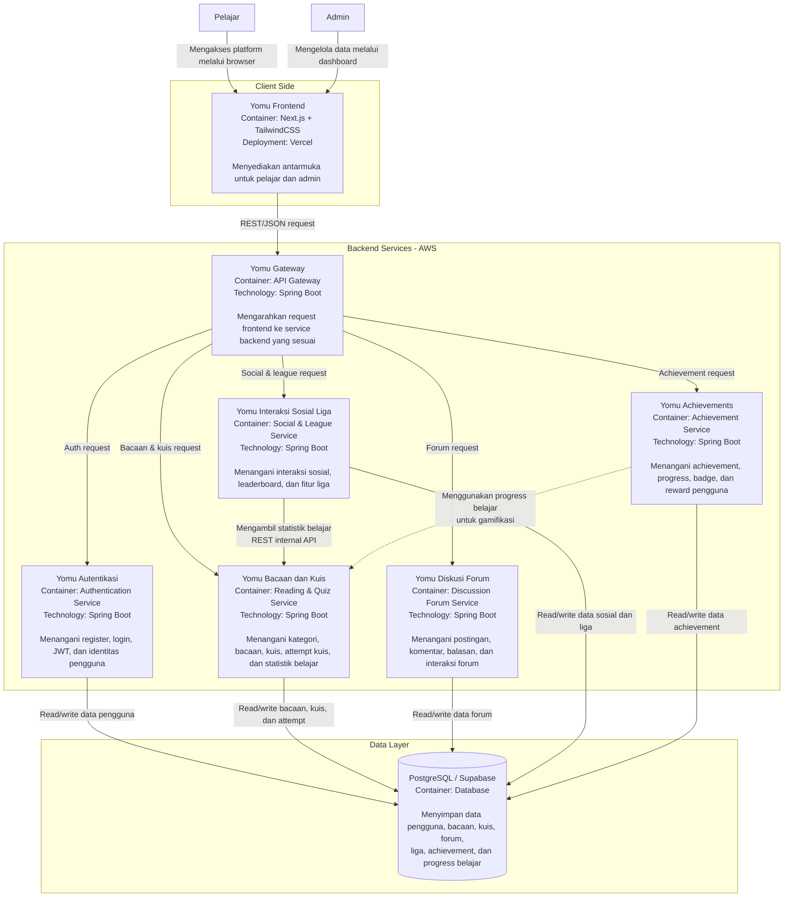

# yomu

### Container Diagram

Arsitektur saat ini pada sistem **Yomu** menggunakan pendekatan berbasis layanan, dengan frontend yang terpisah dari beberapa backend service. Frontend dibangun menggunakan **Next.js** dan **TailwindCSS**, sedangkan backend menggunakan **Spring Boot**. Data aplikasi disimpan pada **PostgreSQL/Supabase**. Untuk deployment, frontend berada di **Vercel**, sementara backend service dijalankan di **AWS**.

### Risk Mitigation - Deliverables G.3

#### Why the risk storming technique is applied?
Kami menerapkan teknik *Risk Storming* untuk mengidentifikasi, memprioritaskan, dan mengurangi risiko teknis dalam sistem **Yomu** yang menggunakan arsitektur *microservices*. Mengingat fungsionalitas aplikasi tersebar ke dalam modul mandiri (Autentikasi, Bacaan & Kuis, Achievements, Interaksi Sosial & Liga, serta Diskusi & Forum), teknik ini membantu kami memetakan potensi kegagalan pada integrasi antar-layanan, konsistensi data *real-time* untuk fitur kompetitif, dan keamanan data pengguna secara kolaboratif.

#### Risk Matrix
| Risk ID | Deskripsi Risiko | Probability (1-10) | Impact (1-10) | Score (P x I) |
| :--- | :--- | :---: | :---: | :---: |
| **R1** | *Race condition* pada pembaruan skor di Modul Achievements dan Liga setelah kuis selesai. | 8 | 8 | **64** |
| **R2** | *Single Point of Failure* pada API Gateway yang mengakibatkan seluruh ekosistem modul mati. | 4 | 10 | **40** |
| **R3** | Kebocoran data pribadi atau manipulasi *state* login pada Modul Autentikasi. | 3 | 10 | **30** |
| **R4** | Latensi tinggi saat memuat konten teks besar di Modul Bacaan & Kuis secara bersamaan. | 6 | 5 | **30** |
| **R5** | Inkoherensi data (data tidak sinkron) antara Modul Interaksi Sosial dan Forum Diskusi. | 5 | 5 | **25** |

#### Current Deployment Risk Diagram

#### Consensus
Melalui sesi *Risk Storming*, kelompok kami menyepakati poin-poin krusial berikut:
1. **Prioritas Tertinggi (R1):** Seluruh partisipan sepakat bahwa sinkronisasi antara **Modul Bacaan & Kuis** dengan **Modul Achievements** dan **Liga** adalah titik paling kritis. Jika pelajar menyelesaikan kuis namun poin tidak ter-update di Liga atau Achievement tidak terbuka, nilai gamifikasi sistem akan gagal.
2. **Keamanan Sentral (R3):** Kami menyepakati bahwa **Modul Autentikasi** adalah gerbang utama. Meskipun probabilitas kecil, dampaknya sangat besar karena melibatkan kredensial pengguna di seluruh modul.
3. **Ketersediaan Layanan (R2):** Tim menyadari bahwa arsitektur *microservices* sangat bergantung pada API Gateway. Kegagalan konfigurasi di Gateway akan memutus akses NextJS ke semua modul backend (Spring Boot).

#### Mitigations
1. **Gamification Sync Mitigation (R1):** Mengimplementasikan mekanisme *asynchronous messaging* (seperti RabbitMQ atau Kafka) atau memastikan *database transaction* yang kuat agar data skor dari Modul Kuis terkirim secara terjamin ke Modul Achievements dan Liga.
2. **Resilience Gateway Mitigation (R2):** Menerapkan *Circuit Breaker* (Resilience4j) di API Gateway dan melakukan konfigurasi *Auto-scaling* pada AWS agar sistem tetap tersedia saat terjadi lonjakan trafik.
3. **Authentication Security Mitigation (R3):** Menggunakan protokol JWT yang aman dengan penyimpanan *HttpOnly Cookie* di sisi NextJS, serta melakukan audit keamanan otomatis menggunakan SonarCloud untuk mencegah celah *Insecure Direct Object Reference* (IDOR).
4. **Performance & Caching Mitigation (R4):** Menerapkan *caching* pada Modul Bacaan untuk konten statis guna mengurangi beban *query* ke PostgreSQL (Supabase) dan mempercepat *loading time* bagi pelajar.
5. **Data Integrity Mitigation (R5):** Menstandarisasi format ID pengguna dari Modul Autentikasi di seluruh repositori modul agar relasi data antara Modul Interaksi Sosial dan Forum Diskusi tetap konsisten.
