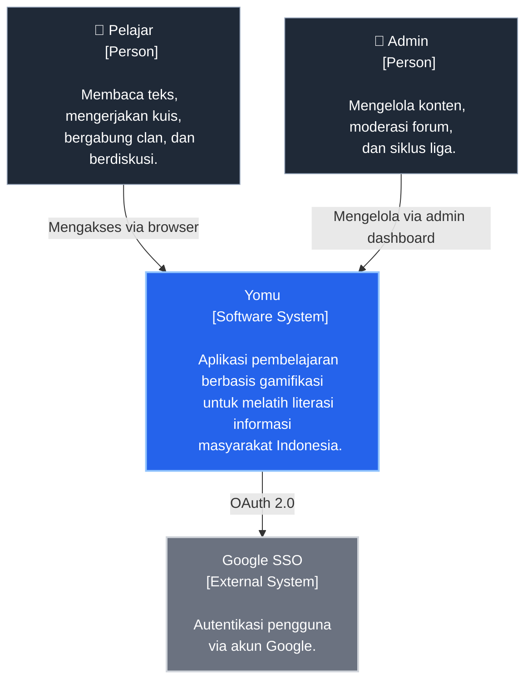
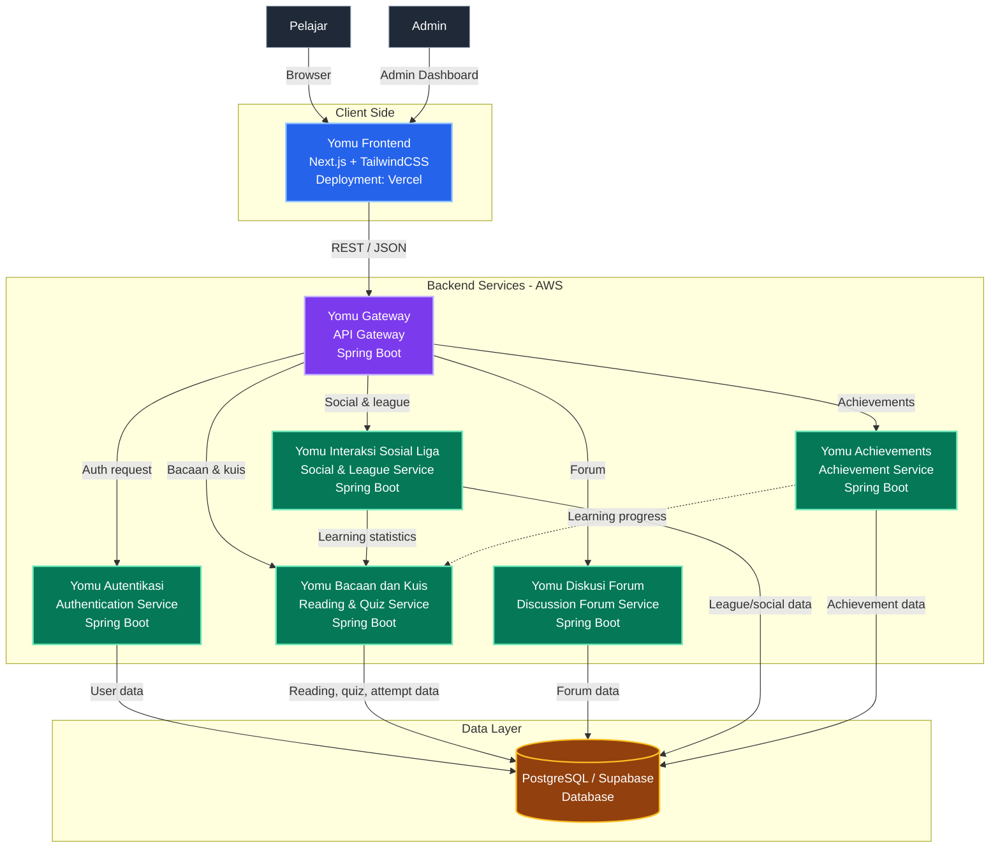
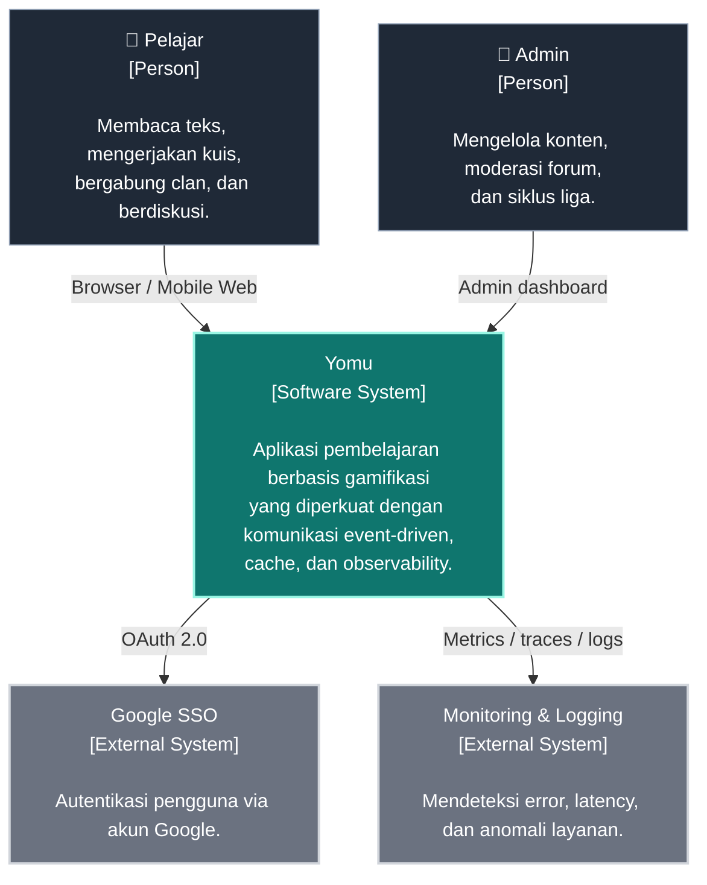
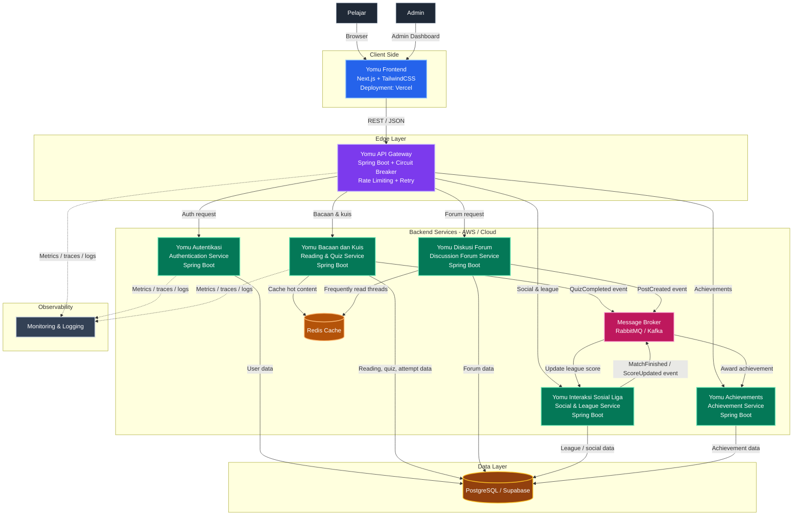

# YOMU

Nama Kelompok = B14  
Nama Anggota =

- Muhammad Nadhif Ibrahim (2406398324)
- Hanif Awiyoso Mahendra (2406439854)
- M. Rafi Ghalib Fideligo (2406495703)
- Anya Aleena Wardhany (2406401773)
- Nezzaluna Azzahra (2406495741)

## Current Architecture of the Application - Deliverable G.1

### Context Diagram

Diagram konteks ini menggambarkan sistem **Yomu** dan interaksinya dengan pengguna serta sistem eksternal pada level tertinggi.

### Container Diagram

Arsitektur saat ini pada sistem **Yomu** menggunakan pendekatan berbasis layanan, dengan frontend yang terpisah dari beberapa backend service. Frontend dibangun menggunakan **Next.js** dan **TailwindCSS**, sedangkan backend menggunakan **Spring Boot**. Data aplikasi disimpan pada **PostgreSQL/Supabase**. Untuk deployment, frontend berada di **Vercel**, sementara backend service dijalankan di **AWS**.

### Deployment Diagram

Diagram deployment ini mengilustrasikan infrastruktur sistem Yomu, di mana aplikasi frontend (Next.js) di-deploy melalui Vercel untuk optimalisasi akses pengguna. Pada sisi backend yang menerapkan pola Microservices, proses deployment kelima modul service beserta database-nya bersifat independen dan dibebaskan menyesuaikan preferensi infrastruktur dari Penanggung Jawab (PIC) masing-masing modul. Meskipun memiliki fleksibilitas penyebaran secara mandiri, deployment utama untuk lingkungan API Gateway dan microservices difokuskan pada platform cloud seperti Koyeb atau AWS guna memastikan kelancaran komunikasi internal dan skalabilitas sistem secara keseluruhan.

## Future Software Architecture - Deliverable G.2

Setelah risk analyzing, arsitektur Yomu diperbarui untuk mengurangi risiko utama pada sinkronisasi nilai, ketergantungan pada API Gateway, dan performa saat beban tinggi. Perubahan yang paling penting adalah penambahan message broker untuk event-driven communication, cache layer untuk konten yang sering dibaca, serta observability layer agar gangguan bisa lebih cepat dideteksi.

### Future Context Diagram

Diagram konteks masa depan menampilkan sistem Yomu yang tetap melayani pelajar dan admin, tetapi kini didukung oleh layanan eksternal tambahan untuk autentikasi dan pemantauan sistem. Perubahan ini menegaskan bahwa platform tidak hanya fokus pada fitur belajar, tetapi juga pada stabilitas, keamanan, dan pemeliharaan operasional.

### Future Container Diagram

Container diagram masa depan menambahkan _API Gateway resilience_, _Redis cache_, dan _message broker_ agar risiko R1, R2, dan R4 lebih terkendali. Dengan pola ini, service yang menghasilkan event bisa memproses data secara asinkron, sementara konten yang sering diakses dapat disajikan lebih cepat tanpa membebani database utama.

### Architecture Change Notes

Perubahan arsitektur ini dibuat untuk mengatasi risiko yang paling besar dari hasil risk storming. Risiko R1 sebelumnya muncul karena hasil kuis, poin liga, dan achievement bergantung pada proses sinkron yang sensitif terhadap kegagalan. Dengan menambahkan message broker, event seperti QuizCompleted tidak lagi harus menunggu update ke semua service selesai di satu alur yang sama, sehingga sistem lebih tahan terhadap lonjakan trafik dan kegagalan sementara.

Risiko R2 dan R4 juga ditangani dengan cara yang lebih struktural. API Gateway ditambah circuit breaker, rate limiting, dan retry agar kegagalan satu service tidak langsung memutus seluruh aplikasi. Sementara itu, Redis cache membantu mempercepat akses konten yang sering dibaca sehingga query ke PostgreSQL berkurang. Observability layer ditambahkan supaya tim bisa memantau latency, error rate, dan anomali lebih cepat, yang mendukung perbaikan sebelum masalah berdampak besar ke pengguna.

Secara keseluruhan, arsitektur masa depan ini lebih cocok untuk sistem gamifikasi yang terus bertambah fiturnya. Desainnya menjaga kebutuhan utama Yomu tetap aman dan responsif, tetapi juga memberi ruang untuk scale service tertentu tanpa harus mengganggu service lain.

## Risk Mitigation - Deliverables G.3

### Why the risk storming technique is applied?

Kami menerapkan teknik _Risk Storming_ untuk mengidentifikasi, memprioritaskan, dan mengurangi risiko teknis dalam sistem **Yomu** yang menggunakan arsitektur _microservices_. Mengingat fungsionalitas aplikasi tersebar ke dalam modul mandiri (Autentikasi, Bacaan & Kuis, Achievements, Interaksi Sosial & Liga, serta Diskusi & Forum), teknik ini membantu kami memetakan potensi kegagalan pada integrasi antar-layanan, konsistensi data _real-time_ untuk fitur kompetitif, dan keamanan data pengguna secara kolaboratif.

### Risk Matrix

| Risk ID | Deskripsi Risiko                                                                            | Probability (1-10) | Impact (1-10) | Score (P x I) |
| :------ | :------------------------------------------------------------------------------------------ | :----------------: | :-----------: | :-----------: |
| **R1**  | _Race condition_ pada pembaruan skor di Modul Achievements dan Liga setelah kuis selesai.   |         8          |       8       |    **64**     |
| **R2**  | _Single Point of Failure_ pada API Gateway yang mengakibatkan seluruh ekosistem modul mati. |         4          |      10       |    **40**     |
| **R3**  | Kebocoran data pribadi atau manipulasi _state_ login pada Modul Autentikasi.                |         3          |      10       |    **30**     |
| **R4**  | Latensi tinggi saat memuat konten teks besar di Modul Bacaan & Kuis secara bersamaan.       |         6          |       5       |    **30**     |
| **R5**  | Inkoherensi data (data tidak sinkron) antara Modul Interaksi Sosial dan Forum Diskusi.      |         5          |       5       |    **25**     |

### Current Deployment Risk Diagram

#### Consensus

Melalui sesi _Risk Storming_, kelompok kami menyepakati poin-poin krusial berikut:

1. **Prioritas Tertinggi (R1):** Seluruh partisipan sepakat bahwa sinkronisasi antara **Modul Bacaan & Kuis** dengan **Modul Achievements** dan **Liga** adalah titik paling kritis. Jika pelajar menyelesaikan kuis namun poin tidak ter-update di Liga atau Achievement tidak terbuka, nilai gamifikasi sistem akan gagal.
2. **Keamanan Sentral (R3):** Kami menyepakati bahwa **Modul Autentikasi** adalah gerbang utama. Meskipun probabilitas kecil, dampaknya sangat besar karena melibatkan kredensial pengguna di seluruh modul.
3. **Ketersediaan Layanan (R2):** Tim menyadari bahwa arsitektur _microservices_ sangat bergantung pada API Gateway. Kegagalan konfigurasi di Gateway akan memutus akses NextJS ke semua modul backend (Spring Boot).

#### Mitigations

1. **Gamification Sync Mitigation (R1):** Mengimplementasikan mekanisme _asynchronous messaging_ (seperti RabbitMQ atau Kafka) atau memastikan _database transaction_ yang kuat agar data skor dari Modul Kuis terkirim secara terjamin ke Modul Achievements dan Liga.
2. **Resilience Gateway Mitigation (R2):** Menerapkan _Circuit Breaker_ (Resilience4j) di API Gateway dan melakukan konfigurasi _Auto-scaling_ pada AWS agar sistem tetap tersedia saat terjadi lonjakan trafik.
3. **Authentication Security Mitigation (R3):** Menggunakan protokol JWT yang aman dengan penyimpanan _HttpOnly Cookie_ di sisi NextJS, serta melakukan audit keamanan otomatis menggunakan SonarCloud untuk mencegah celah _Insecure Direct Object Reference_ (IDOR).
4. **Performance & Caching Mitigation (R4):** Menerapkan _caching_ pada Modul Bacaan untuk konten statis guna mengurangi beban _query_ ke PostgreSQL (Supabase) dan mempercepat _loading time_ bagi pelajar.
5. **Data Integrity Mitigation (R5):** Menstandarisasi format ID pengguna dari Modul Autentikasi di seluruh repositori modul agar relasi data antara Modul Interaksi Sosial dan Forum Diskusi tetap konsisten.
